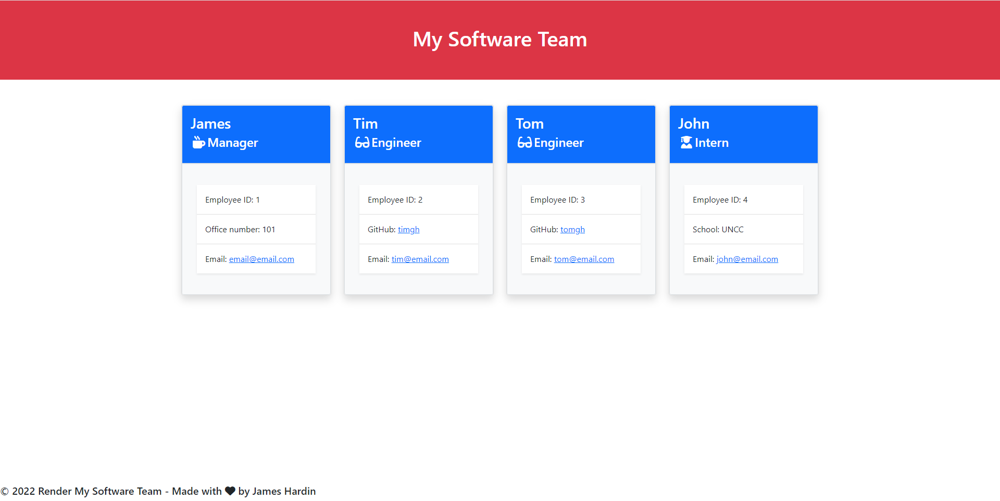

# Render-My-Software-Team

## About
Generate a roster of profiles for your software team

The webpage includes:
- Profile cards for team manager, engineers, and interns
- Github profile links for engineers
- Intern's school displayed on card
- Manager's office number displayed on card
- and email links and employee id's for all team members

## Installation
Execute this command in your terminal: npm install

## Usage
Clone the repo, open in a source-code editor, install dependencies,
and execute command node index.js to start the application.
Once finished building your team the html file will be writen to dist/

## Webpage

## Walkthrough
here